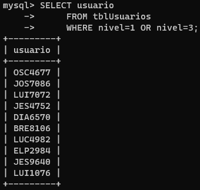

# Reto-Sql
### Bloque 1

##### Consultas

1. Listar los nombres de los usuarios

   ```sql
   # Solucion en 'sql'
    SELECT nombre FROM tblUsuarios;
   ```
   


2. Calcular el saldo máximo de los usuarios de sexo “Mujer”

     ```sql
    # Solucion en 'sql'
      SELECT MAX(saldo)
    -> FROM tblUsuarios
    -> Where sexo = "M";
     ```
     

     

3. Listar nombre y teléfono de los usuarios con teléfono NOKIA, BLACKBERRY o SONY

     ```sql
      # Solucion en 'sql'
      SELECT nombre,telefono
    -> FROM tblUsuarios
    -> Where marca = "NOKIA" OR marca = "BLACKBERRY" OR marca = "SONY";
     ```
     


4. Contar los usuarios sin saldo o inactivos

     ```sql
      # Solucion en 'sql'
      SELECT COUNT(*)
    -> FROM tblUsuarios
    -> WHERE saldo = 0 OR activo = false;
     ```
     

     

5. Listar el login de los usuarios con nivel 1, 2 o 3

     ```sql
      # Solucion en 'sql'
      SELECT usuario
    -> FROM tblUsuarios
    -> WHERE nivel = 1 OR nivel = 2 OR nivel = 3;
     ```
     

     

6. Listar los números de teléfono con saldo menor o igual a 300

     ```sql
      # Solucion en 'sql'
      SELECT telefono
    -> FROM tblUsuarios
    -> WHERE saldo <= 300;
     ```
     


7. Calcular la suma de los saldos de los usuarios de la compañia telefónica NEXTEL

     ```sql
      # Solucion en 'sql'
      SELECT SUM(saldo)
    -> FROM tblUsuarios
    -> WHERE compañia = "NEXTEL";
     ```
     


8. Contar el número de usuarios por compañía telefónica

     ```sql
      # Solucion en 'sql'
      SELECT compañia, COUNT(*) AS usuarios
    -> FROM tblUsuarios
    -> GROUP BY compañia;
     ```
     


9. Contar el número de usuarios por nivel

     ```sql
      # Solucion en 'sql'
      SELECT nivel, COUNT(*) AS usuarios
    -> FROM tblUsuarios
    -> GROUP BY nivel;
     ```
     

     

10. Listar el login de los usuarios con nivel 2

      ```sql
       # Solucion en 'sql'
       SELECT usuario
    -> FROM tblUsuarios
    -> WHERE nivel = 2;
      ```
      


11. Mostrar el email de los usuarios que usan gmail

      ```sql
       # Solucion en 'sql'
       SELECT email
    -> FROM tblUsuarios
    -> WHERE email LIKE "%gmail%";
      ```
      


12. Listar nombre y teléfono de los usuarios con teléfono LG, SAMSUNG o MOTOROLA

      ```sql
       # Solucion en 'sql'
     SELECT nombre,telefono
    -> FROM tblUsuarios
    -> Where marca = "LG" OR marca = "SAMSUNG" OR marca = "MOTOROLA";
      ```
      


------

### Bloque 2

##### Consultas

1. Listar nombre y teléfono de los usuarios con teléfono que no sea de la marca LG o SAMSUNG

     ```sql
      # Solucion en 'sql'
      SELECT nombre,telefono
    -> FROM tblUsuarios
    -> WHERE marca NOT IN ("LG", "SAMSUNG");
     ```
     


2. Listar el login y teléfono de los usuarios con compañia telefónica IUSACELL

     ```sql
      # Solucion en 'sql'
      SELECT usuario, telefono
    -> FROM tblUsuarios
    -> WHERE compañia = "IUSACELL";
     ```
     


3. Listar el login y teléfono de los usuarios con compañia telefónica que no sea TELCEL

     ```sql
      # Solucion en 'sql'
      SELECT usuario, telefono
    -> FROM tblUsuarios
    -> WHERE compañia != "TELCEL";
     ```
     


4. Calcular el saldo promedio de los usuarios que tienen teléfono marca NOKIA

     ```sql
      # Solucion en 'sql'
      SELECT AVG(saldo) AS PROMEDIO
    -> FROM tblUsuarios
    -> WHERE marca = "NOKIA";
     ```
     


5. Listar el login y teléfono de los usuarios con compañia telefónica IUSACELL o AXEL

     ```sql
      # Solucion en 'sql'
      SELECT usuario, telefono
    -> FROM tblUsuarios
    -> WHERE compañia = "IUSACELL" OR compañia = "AXEL";
     ```
     


6. Mostrar el email de los usuarios que no usan yahoo

     ```sql
      # Solucion en 'sql'
      SELECT email
     FROM tblUsuarios
     WHERE email NOT LIKE '%yahoo%';
     ```
     


7. Listar el login y teléfono de los usuarios con compañia telefónica que no sea TELCEL o IUSACELL

     ```sql
      # Solucion en 'sql'
       SELECT usuario, telefono
    -> FROM tblUsuarios
    -> WHERE compañia NOT IN("TELCEL","IUSACELL");
     ```
     

     

8. Listar el login y teléfono de los usuarios con compañia telefónica UNEFON

     ```sql
      # Solucion en 'sql'
      SELECT usuario, telefono
     FROM tblUsuarios
     WHERE compañia = "UNEFON";
     ```
     


9. Listar las diferentes marcas de celular en orden alfabético descendentemente

     ```sql
      # Solucion en 'sql'
      SELECT DISTINCT marca
     FROM tblUsuarios
     ORDER BY marca DESC;
     ```
     


10. Listar las diferentes compañias en orden alfabético aleatorio

      ```sql
       # Solucion en 'sql'
      SELECT DISTINCT compañia
     FROM tblUsuarios
     ORDER BY RAND();
      ```
      


11. Listar el login de los usuarios con nivel 0 o 2

      ```sql
       # Solucion en 'sql'
     SELECT usuario
     FROM tblUsuarios
     WHERE nivel=0 OR nivel=2;
      ```
      


12. Calcular el saldo promedio de los usuarios que tienen teléfono marca LG

      ```sql
       # Solucion en 'sql'
       SELECT AVG(saldo) AS PROMEDIO
    -> FROM tblUsuarios
    -> WHERE marca = "LG";
      ```
      


------

### Bloque 3

##### Consultas

1. Listar el login de los usuarios con nivel 1 o 3

     ```sql
      # Solucion en 'sql'
      SELECT usuario
     FROM tblUsuarios
     WHERE nivel=1 OR nivel=3;
     
     ```
     


2. Listar nombre y teléfono de los usuarios con teléfono que no sea de la marca BLACKBERRY

     ```sql
      # Solucion en 'sql'
      SELECT nombre, telefono
    -> FROM tblUsuarios
    -> WHERE marca != "BLACKBERRY";
     ```
     


3. Listar el login de los usuarios con nivel 3

     ```sql
      # Solucion en 'sql'
      SELECT usuario
     FROM tblUsuarios
     WHERE nivel=3;
     ```
     


4. Listar el login de los usuarios con nivel 0

     ```sql
      # Solucion en 'sql'
      SELECT usuario
     FROM tblUsuarios
     WHERE nivel=0;
     ```
     


5. Listar el login de los usuarios con nivel 1

     ```sql
      # Solucion en 'sql'
      SELECT usuario
     FROM tblUsuarios
     WHERE nivel=1;
     ```
     


6. Contar el número de usuarios por sexo

     ```sql
      # Solucion en 'sql'
      SELECT sexo, COUNT(*) AS USUARIOS
    -> FROM tblUsuarios
    -> GROUP BY sexo;
     ```
     


7. Listar el login y teléfono de los usuarios con compañia telefónica AT&T

     ```sql
      # Solucion en 'sql'
      SELECT usuario, telefono
     FROM tblUsuarios
     WHERE compañia = "AT&T";
     ```
     


8. Listar las diferentes compañias en orden alfabético descendentemente

     ```sql
      # Solucion en 'sql'
      SELECT DISTINCT compañia
     FROM tblUsuarios
     ORDER BY compañia DESC;
     ```
     


9. Listar el logn de los usuarios inactivos

     ```sql
      # Solucion en 'sql'
      SELECT usuario
     FROM tblUsuarios
     WHERE activo = false;
     ```
     


10. Listar los números de teléfono sin saldo

      ```sql
       # Solucion en 'sql'
       SELECT telefono
       FROM tblUsuarios
       WHERE saldo = 0;
      ```
      


11. Calcular el saldo mínimo de los usuarios de sexo “Hombre”

      ```sql
       # Solucion en 'sql'
       SELECT MIN(saldo) AS min_saldo
       FROM tblUsuarios
       WHERE sexo = 'H';
      ```
      


12. Listar los números de teléfono con saldo mayor a 300

      ```sql
       # Solucion en 'sql'
       SELECT telefono
       FROM tblUsuarios
       WHERE saldo >= 300;
      ```
      


------

### Bloque 4

##### Consultas

1. Contar el número de usuarios por marca de teléfono

     ```sql
      # Solucion en 'sql'
      SELECT COUNT(*) as total, marca
      FROM tblUsuarios
      GROUP BY marca;
     ```
     


2. Listar nombre y teléfono de los usuarios con teléfono que no sea de la marca LG

     ```sql
      # Solucion en 'sql'
      SELECT nombre, telefono
      FROM tblUsuarios
      WHERE marca != 'LG';
     ```
     


3. Listar las diferentes compañias en orden alfabético ascendentemente

     ```sql
      # Solucion en 'sql'
      SELECT DISTINCT compañia
      FROM tblUsuarios
      ORDER BY compañia ASC;
     ```
     


4. Calcular la suma de los saldos de los usuarios de la compañia telefónica UNEFON

     ```sql
      # Solucion en 'sql'
      SELECT SUM(saldo) as totalSaldo
      FROM tblUsuarios
      WHERE compañia = 'UNEFON';
     ```
     


5. Mostrar el email de los usuarios que usan hotmail

     ```sql
      # Solucion en 'sql'
      SELECT email
      FROM tblUsuarios
      WHERE email LIKE '%hotmail%';
     ```
     


6. Listar los nombres de los usuarios sin saldo o inactivos

     ```sql
      # Solucion en 'sql'
      SELECT nombre
      FROM tblUsuarios
      WHERE saldo = 0 OR activo = false;
     ```
     


7. Listar el login y teléfono de los usuarios con compañia telefónicaIUSACELL o TELCEL

     ```sql
      # Solucion en 'sql'
      SELECT usuario, telefono
      FROM tblUsuarios
      WHERE compañia = "TELCEL" OR compañia = "IUSACELL";
     ```
     


8. Listar las diferentes marcas de celular en orden alfabético ascendentemente

     ```sql
      # Solucion en 'sql'
      SELECT DISTINCT marca
      FROM tblUsuarios
      ORDER BY marca ASC;
     ```
     

     

9. Listar las diferentes marcas de celular en orden alfabético aleatorio

     ```sql
      # Solucion en 'sql'
      SELECT DISTINCT marca
      FROM tblUsuarios
      ORDER BY RAND();
     ```
     


10. Listar el login y teléfono de los usuarios con compañia telefónica IUSACELL o UNEFON

      ```sql
       # Solucion en 'sql'
       SELECT usuario, telefono
       FROM tblUsuarios
       WHERE compañia = "UNEFON" OR compañia = "IUSACELL";
      ```
      


11. Listar nombre y teléfono de los usuarios con teléfono que no sea de la marca MOTOROLA o NOKIA

      ```sql
       # Solucion en 'sql'
       SELECT nombre, telefono
       FROM tblUsuarios
       WHERE marca NOT IN( "MOTOROLA", "NOKIA");
      ```
      


12. Calcular la suma de los saldos de los usuarios de la compañia telefónica TELCEL

      ```sql
       # Solucion en 'sql'
       SELECT SUM(saldo) AS totalSaldo
       FROM tblUsuarios
       WHERE compañia = "TELCEL";
      ```
      

